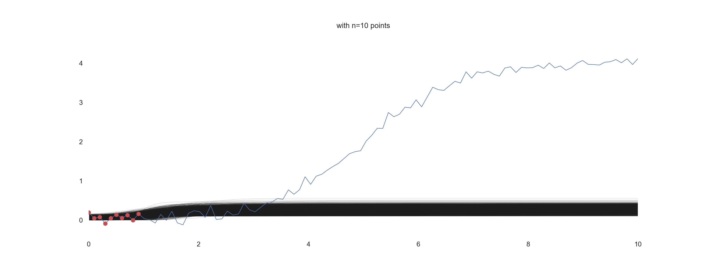

# Logistic Functions and Probabilistic Programming

Sebastien Soudan

Quick tutorial on Bayesian inference. See the [notebook](bayesian_inference.ipynb) for the actual code.

(If you know a way to have latex equations in GH markdown that can be read both in light and dark themes, let me know.)

## Logistic functions

Logistic functions are S-shaped functions that represent phenomena with an exponential growth under a finite capacity.
Stated differently they are solutions to the following differential equation:


which states that the growth rate: 


is the product of:
1. the number of infected patients: 

2. the some sort of contagiousness: 
3. the proportion of not infected patient: 


This results in functions of the form:


where ,  and  are values to be determined:
-  is the right asymptote and plays a role of capacity,
-  affects the steepness of the transition and 
-  the point where this happens around.

BTW if you want a slightly more complicated model of epidemic spread, 
check [SEIR models](https://en.wikipedia.org/wiki/Compartmental_models_in_epidemiology).

Ok, great, now how do we estimate these parameters if we just have observations?

## Bayesian inference


Sad news: actual data will be noisier than the idealistic model presented above. 

We will take a Bayesian approach: the data are what they are, what carries uncertainty is our estimates of the 
parameters. So our parameters  are modeled as distributions .

We are looking for the parameters given the data we have observed:

. This is called the *posterior distribution*.

Using Bayes formula, we have:


We have a tool to draw samples from this distribution: MCMC samplers. 
We will skip the details. The important point is that this method is made available
relatively straightforwardly under the name of *probabilistic programming*.

A probabilistic program essentially defines the prior , 
the process to generate data from : 
 and given the observation  can generate samples from  
. If generate enough samples we can get a pretty good idea of what the distribution looks like
or we can use this to compute quantities under this distribution - say median or percentiles for examples to compare 
alternatives, as in Bayesian AB testing.

Back to our initial problem of estimating the logistic function that match our data.
For our case, we want samples (jointly sampled) from ,  and  so we can compute our  for a range of 
values of ,  and  so we can compute our  - possibly a little bit in the future. 

Using numpyro, this is what the 'model()' function does given some observations provided as two vectors of observations *x_obs* and *y_obs*:

```python
def model(x_obs, y_obs=None):        
    x_max = jnp.max(x_obs)
    y_max = jnp.max(y_obs)
    
    L = numpyro.sample("L", dist.TruncatedNormal(y_max, y_max/2, low=y_max))
    x_0 = numpyro.sample("x_0", dist.Normal(x_max, x_max/2))
    k = numpyro.sample("k", dist.TruncatedNormal(1.0, 3.0, low=0)) 

    y_est = L / (1 + jnp.exp(-k*(x_obs-x_0)))

    epsilon = numpyro.sample("epsilon", dist.HalfNormal())

    numpyro.sample("y", dist.Normal(y_est, epsilon), obs=y_obs)
```

And with a bit of boiler plate - see the notebook for more of it: 

Red dots are points used for the observation, blue line is the reference data, thin black lines are lines drawn from 
the posterior.

**The point to remember**: if you have data and a parameterized model that could 
have generated them, using probabilistic programming you can recover the distribution of these parameters by 
throwing CPU (or GPU) cycles at the problem. Very powerful. See https://arxiv.org/pdf/1405.4720.pdf.

The notebook is [here](bayesian_inference.ipynb).

Have fun!

## References

Theory:
- http://www.columbia.edu/~mh2078/MonteCarlo/MCMC_Bayes.pdf
- https://papers.ssrn.com/sol3/papers.cfm?abstract_id=3759243
- https://en.wikipedia.org/wiki/Bayesian_inference

Examples of applications:
- https://num.pyro.ai/en/stable/tutorials/
- https://docs.pymc.io/en/v3/nb_examples/index.html
- [Bayesian Optimization - shameless self promotion to a post I wrote some time ago](https://ssoudan.blog/public/posts/2020-10-15-bo.html) - a form of blackbox optimization.

Books and courses:
- [Bayesian methods for Hackers, Cam Davidson-Pilon](https://camdavidsonpilon.github.io/Probabilistic-Programming-and-Bayesian-Methods-for-Hackers/)
- [Statistical Rethinking, Richard McElreath](https://xcelab.net/rm/statistical-rethinking/)
- [Probabilistic Graphical Models, Daphne Koller](https://www.coursera.org/learn/probabilistic-graphical-models)

## Running the notebook

### Deps

    conda create --name bayesian_inference_tut python=3.10
    conda activate bayesian_inference_tut 
    conda install -y -c conda-forge numpyro matplotlib scipy pandas seaborn plotly arviz graphviz
    pip install jax jaxlib graphviz ipyimpl

or:

    conda create -f environment.yml
    conda activate bayesian_inference_tut

### Animation

    convert -delay 100  -dispose Background -background White -alpha remove -alpha off *.png animated.gif
